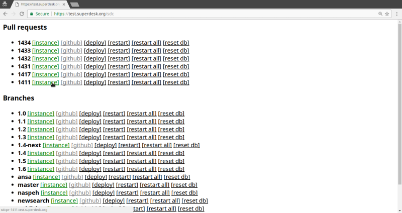
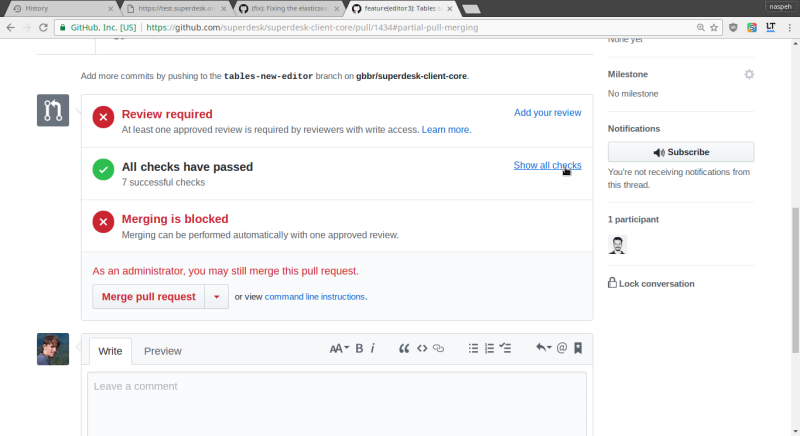
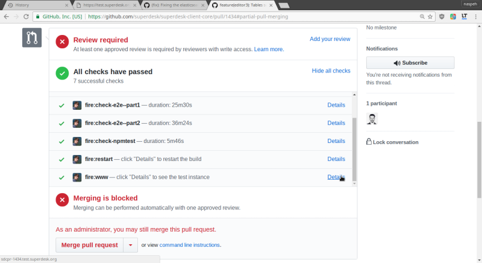

# [test.superdesk.org](https://test.superdesk.org)

**Uses login via Github, also people must be in [Superdesk Organisation][sd-people] to get access here.**

[sd-people]: https://github.com/orgs/superdesk/people

The main page contains the list of enabled repositories.

A repository page contains a list of **Pull Requests** and **Branches** with related links:
- `[instance]` link to the test instance
- `[latest logs]` link to the latest ci logs
- `[deploy]` runs only deployment step
- `[restart]` runs failed/waiting steps if they are exist or runs all steps
- `[restart all]` runs all steps (including `build` step)
- `[reset db]` resets databases for the test instance



## Test instance

**There are no real emails (by default),** all emails are stored in log files and can be found by url: `<domain>/mail`.

**Server logs** for particular instance can be found by url `<domain>/logs`.

For example for `sd-master`:
- https://sd-master.test.superdesk.org/mail/ emails
- https://sd-master.test.superdesk.org/logs/ logs

### Docs
Docs are generated for `superdek-core` (`<domain>/docs/`), for example:
- https://sds-master.test.superdesk.org/docs/

# Github integration

After webhook is invoked by Github, `fireq` uses [Github API][gh-statuses] to post statuses.

[gh-statuses]: https://developer.github.com/v3/repos/statuses/




## Minimal set of statuses
```
├─ fire:build       # build code for the proper git commit
├─ fire:www         # deploy the test instance, contains the link if successful
├─ fire:restart     # the way to restart failed (or all) steps from Github interface
```

# Admin area
You need `SSH` access to `host7.sourcefabric.org`.

All steps can be run from shell, web server just calls this scripts in background.
```sh
cd /opt/fireq       # code
./fire -h           # help messages are pretty detailed
./fire ci -h

vim config.json     # config
./fire config       # show all config values (with defaults ones)

# run ci for superdesk/superdesk master branch
./fire ci sd master
./fire ci sd master -t build -t www
./fire ci sd master --all

# run ci for superdesk/superdesk-ntb master branch
./fire ci ntb master

# reset database
./fire ci sd naspeh -t reset
# backup database
./fire lxc-db -b - sd-master  # loads $DB_HOST and $DB_NAME inside container
./fire lxc-db -b - data-sd --db-name sd-master  # backup in data container
# restore database
./fire lxc-db -cr sd-sdsite-20170503 sd-naspeh

# update nginx for ci instances
./fire ci-nginx

# next two command are running by cron /etc/cron.d/fireq
./fire gh-clean # clean containers by checking Github for alive PRs and branches
./fire gh-pull  # check if ci have been runnnig for all PRs and branches

# shortcut for ssh-ing to container with no interruption and fully-worked shell
./fire lxc-ssh sd-master

# lxc containers uses zfs
zfs list
ll /var/tmp/zpool.*

# container with presistent mongo and elastic, local redis is used everywhere
cat config.json | grep lxc_data
lxc-ls -f | grep data-sd

# base container with all packages installed for CI
cat config.json | grep lxc_base
lxc-ls -f | grep base-sd
```

`fireq.cli` uses [mustache][mustache] templates in `tpl` directory to generate straightforward bash scripts.

[mustache]: https://mustache.github.io/mustache.5.html

## Github statuses
`./fire ci` posts proper statuses to Github if config values are filled:
```json
"no_statuses": false
"github_basic": "token:<token>"
```

### Get token for [your application](#login-via-github)
```sh
curl -XPOST -u <username> https://api.github.com/authorizations -d '{
"client_id": "<github_id>",
"client_secret": "<github_secret>",
"note": "fireq",
"scopes": ["public_repo", "read:org"]
}'
```

### Get personal token
Create token here: https://github.com/settings/tokens

## SSL certificates
The test instances for branches are using SSL certificates, but they are generated manually because of [Let’s Encrypt rate limits](https://letsencrypt.org/docs/rate-limits/), so if you need green one:
```sh
./fire ci-nginx --live
ll /etc/nginx/certs/ci
```

## Env variables
There are init files in [tpl/init][init], which invoked after build step
```sh
# superdesk/superdesk-client-core new-thing branch
cat <<EOF2 > tpl/init/sdc-newthing.sh
{{>init/sd.sh}}

cat <<"EOF" >> {{config}}
# there are variables
WEBHOOK_PERSONALIA_AUTH=1234
EOF
EOF2

# deploy with new init
./fire ci sdc new-thing -t deploy

# see example
cat tpl/init/sd-naspeh.sh
```

[init]: https://github.com/superdesk/fireq/tree/master/tpl/init

## fireq.web - webhook and dashboard
```sh
systemd restart fireq
cat /etc/systemd/system/fireq.service

# systemd service runs gunicorn like this
gunicorn fireq.web:app --bind localhost:8080 --worker-class aiohttp.worker.GunicornWebWorker
```

### Webhook
```
Payload URL: https://test.superdesk.org/hook
Secret: <"secret" from config.json>
```

### Login via Github
Fill `github_id` and `github_secret` config values from [one of applications.][gh-apps]

[gh-apps]: https://github.com/organizations/superdesk/settings/applications

## Upgrade
```sh
cd /opt/fireq
git pull

# mostly needed if fireq/web.py is changed
systemd restart fireq
```

## Troubleshooting
If `[restart]` and `[restart-all]` is not working from Dashboard, then look at proper logs to find an issue.

```sh
# Sometimes "lxc-destroy" is not working properly, because underlying ZFS
zfs destroy lxc/sd-something
lxc-destroy -fn sd-something

# Sometimes it needs to run "lxc-destroy" manually for some reason
lxc-destroy -fn sd-something
```
